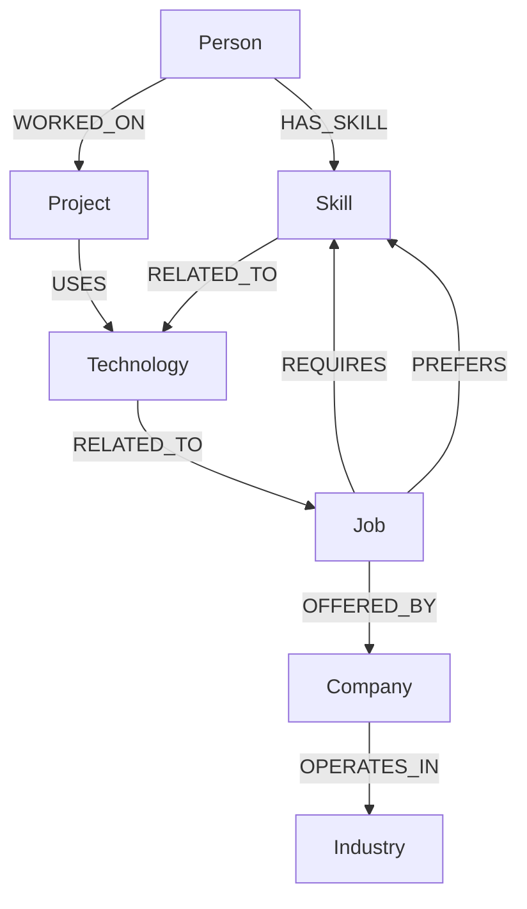

# CareerGraph

> **A graph-powered career intelligence platform that connects skills, projects, technologies, and job opportunities to help developers understand where they fit — and where they can grow.**

CareerGraph is a full-stack web application built for the Wexa AI CognoDB take-home assignment.

Instead of treating a candidate's skills and job requirements as isolated lists, CareerGraph models career information as a connected graph. This makes it possible to traverse relationships between a person, their skills, projects, technologies, industries, companies, and job opportunities to produce meaningful recommendations and identify potential skill gaps.

---

## ✨ What CareerGraph Does

CareerGraph gives a developer a visual representation of how their experience connects to the job market.

The application provides:

* 🔐 Supabase-powered authentication
* 📊 Personalized career dashboard
* 💼 Job opportunity recommendations
* 🎯 Job-to-candidate match scores
* 🧩 Required and preferred skill matching
* 📈 Skill-gap identification
* 🔎 Full job opportunity exploration
* 🕸️ Interactive graph explorer
* 🔗 Node and relationship inspection
* ⚡ Loading, empty, and error states
* 🌐 Production-ready deployment architecture

The underlying career data is stored and queried using **CognoDB**, a managed graph database compatible with the official Neo4j JavaScript driver.

---

## 🧠 Why a Graph Database?

Career data is inherently relational.

A person's suitability for a job isn't determined simply by whether two rows contain the same skill. The interesting questions involve **paths through multiple entities**.

For example:

```text
Person
  │
  ├── HAS_SKILL ──> Skill
  │                    │
  │                    └── USED_BY ──> Technology
  │
  └── WORKED_ON ──> Project
                       │
                       └── USES ──> Technology
                                      │
                                      └── REQUIRED_BY ──> Job
```

A relational database can represent these relationships using junction tables, but as the number of relationship types grows, queries involving multiple paths become increasingly cumbersome.

With a graph database, these relationships are first-class citizens.

CareerGraph can ask questions such as:

* Which jobs are connected to the skills a person possesses?
* Which technologies connect a person's projects to a job?
* Which required skills does a person already have?
* Which skills are missing from otherwise relevant opportunities?
* What relationships exist between a particular person, technology, company, industry, and opportunity?
* What opportunities can be reached through multiple relationship hops?

These are exactly the kinds of questions for which graph traversal provides a natural model.

---

# 🏗️ Architecture

```text
┌───────────────────────────────┐
│          Next.js App          │
│                               │
│  Dashboard │ Jobs │ Explorer  │
│       │       │       │       │
└───────┼───────┼───────┼───────┘
        │       │       │
        ▼       ▼       ▼
┌───────────────────────────────┐
│       Server/API Layer        │
│                               │
│  Graph queries + data shaping │
│  Authentication checks        │
└───────────────┬───────────────┘
                │
                │ Neo4j Driver
                ▼
┌───────────────────────────────┐
│           CognoDB             │
│                               │
│ Person                        │
│ Skill                         │
│ Project                       │
│ Technology                    │
│ Job                           │
│ Company                       │
│ Industry                      │
└───────────────────────────────┘

          ┌─────────────┐
          │  Supabase   │
          │    Auth     │
          └─────────────┘
```

Supabase is responsible for authentication, while CognoDB is the application's graph data layer.

The authenticated Supabase user is mapped to the corresponding `Person` node in CognoDB, allowing the application to retrieve career information for the correct user.

---

# 🕸️ Graph Data Model

CareerGraph uses the following node types:

| Node         | Purpose                                              |
| ------------ | ---------------------------------------------------- |
| `Person`     | Represents a candidate/user                          |
| `Skill`      | A professional skill                                 |
| `Project`    | A project belonging to a person                      |
| `Technology` | A technology used within a career/project context    |
| `Job`        | A career opportunity                                 |
| `Company`    | A company offering opportunities                     |
| `Industry`   | An industry associated with a company or opportunity |

The graph is designed around the connections between these entities rather than treating each entity as an isolated record.

### Simplified graph



The exact relationships used by the application are defined in the seed data and Cypher queries included in the repository.

---

# 🎯 Job Matching

CareerGraph uses the relationships in the graph to determine how closely an opportunity aligns with a person's career profile.

A job can be evaluated against:

* Required skills
* Preferred skills
* Existing candidate skills
* Related technologies
* Candidate projects
* Other graph relationships

The resulting job data is normalized for the frontend and exposed with matching information such as:

```text
matchScore
matchingRequired
totalRequired
```

This allows the UI to communicate not only **which jobs are relevant**, but also **why they are relevant**.

---

# 🔎 Graph Explorer

The Graph Explorer provides a visual way to inspect CareerGraph's underlying data.

Users can:

1. Explore connected nodes.
2. Select individual nodes.
3. Inspect node properties.
4. View incoming and outgoing relationships.
5. Understand how different career entities connect.

For example, selecting a `Person` node can reveal relationships to their skills and projects, while traversing those relationships can expose technologies, opportunities, companies, and industries connected to their career profile.

This makes the graph database tangible rather than hiding it entirely behind the application's recommendation system.

---

# 🧪 Graph Queries

The application uses **parameterized Cypher queries** through the official Neo4j JavaScript driver.

Queries include operations for:

### Career profile retrieval

Retrieves a person's connected career information including skills, projects, and technologies.

### Job recommendations

Traverses relationships between a person's career profile and job requirements to identify relevant opportunities.

### Skill-gap detection

Identifies skills required by relevant opportunities that are not currently represented in the person's career graph.

### Multi-hop traversal

CareerGraph also performs traversals across multiple relationship hops.

For example, a career relationship can be explored through a path such as:

```text
Person
  ↓
Project
  ↓
Technology
  ↓
Job
```

This type of connected query is one of the primary reasons a graph model is useful for the application.

---

# 🌱 Seed Data

The repository includes a seed script that creates realistic CareerGraph data.

The seed data contains interconnected:

* People
* Skills
* Projects
* Technologies
* Jobs
* Companies
* Industries

This allows the application to demonstrate graph traversal and recommendations immediately after database setup.

The seed script is intentionally kept within the size constraints of CognoDB's free tier.

---

# 🛠️ Technology Stack

### Frontend

* Next.js
* React
* JavaScript
* Tailwind CSS
* Framer Motion
* Lucide React

### Backend / Data

* Next.js Server Components and Route Handlers
* CognoDB
* Cypher
* Neo4j JavaScript Driver

### Authentication

* Supabase Auth

### Deployment

* Vercel

---

# 📁 Project Structure

```text
careergraph/
├── app/
│   ├── dashboard/
│   ├── jobs/
│   ├── explorer/
│   └── ...
│
├── components/
│   ├── jobs/
│   ├── graph/
│   ├── ...
│ 
│
├── lib/
│   ├── cognodb/
│   ├── supabase/
│   └── ...
│
├── scripts/
│   └── seed.js
│
├── public/
│
├── .env.example
├── package.json
└── README.md
```

---

# 🚀 Getting Started

## 1. Clone the repository

```bash
git clone https://github.com/Gaius-codes/careergraph
cd careergraph
```

## 2. Install dependencies

```bash
npm install
```

## 3. Create a CognoDB instance

Create a free CognoDB Cloud account:

https://console.cognodb.com/signup

Create a free `c0` instance.

CognoDB provides a Bolt connection URI similar to:

```text
bolt+s://<instance-id>.databases.cognodb.cloud
```

The generated database password should be saved securely because CognoDB displays it only once.

---

## 4. Configure environment variables

Create a local environment file:

```bash
.env.local
```

Add the required credentials:

```env
COGNODB_URI=bolt+s://<instance-id>.databases.cognodb.cloud
COGNODB_USERNAME=cognodb
COGNODB_PASSWORD=<your-cognodb-password>

NEXT_PUBLIC_SUPABASE_URL=<your-supabase-url>
NEXT_PUBLIC_SUPABASE_ANON_KEY=<your-supabase-anon-key>
```

Never commit `.env.local` or any file containing credentials.

---

# 🌱 Seed the Database

After creating the CognoDB instance and configuring the environment variables, run the included seed script:

```bash
node scripts/seed.js
```

The script creates the application's graph data and relationships.

---

# ▶️ Run the Application

Start the development server:

```bash
npm run dev
```

Then open:

```text
http://localhost:3000
```

---

# 🔐 Authentication

CareerGraph uses Supabase Authentication for user identity.

After authentication, the user's Supabase ID is associated with their corresponding `Person` node in CognoDB.

This allows the application to maintain a clear separation between:

* **Identity and authentication** → Supabase
* **Career graph and relationships** → CognoDB

---

# ⚠️ Error Handling

The application handles several important non-happy-path states:

* Database connection failures
* Empty recommendation results
* Empty graph results
* Loading states during route transitions
* Authentication states
* Missing graph properties
* Missing job/skill data

Database credentials are read exclusively from environment variables and are never committed to source control.

---

# 📸 Screenshots

Screenshots of the application are included below.

### Dashboard


### Job Opportunities


### Job Details


### Graph Explorer


---

# 🌐 Live Demo

**Demo:** `https://careergraph-black.vercel.app/`

The live application is deployed using Vercel and connects to the hosted CognoDB instance.

> The CognoDB instance must remain running while the application is being evaluated.

---

# 🎥 Demo Walkthrough

A short screen recording demonstrating the application is available here:

[](https://www.youtube.com/watch?v=tYos7ESvTfU)
*Click the image above to watch the full demo video.*

The walkthrough demonstrates:

1. Authentication
2. Personalized dashboard
3. Job recommendations
4. Match scores and skill matching
5. Job details
6. Graph Explorer
7. Node and relationship inspection

---

# 💡 Why CareerGraph?

Traditional job boards generally treat matching as a keyword problem:

```text
Candidate skills ↔ Job keywords
```

CareerGraph treats career matching as a **relationship problem**:

```text
Person
  ↓
Skills
  ↓
Projects
  ↓
Technologies
  ↓
Jobs
  ↓
Companies
  ↓
Industries
```

This representation makes it possible to reason about the connections surrounding a candidate rather than simply comparing two lists of words.

That is the core idea behind CareerGraph:

> **Your career isn't a list of skills. It's a graph of experiences, technologies, relationships, and opportunities.**

---

# 📄 Assignment

Built as a take-home project for:

**Wexa AI — CognoDB Graph Database Application**

The project demonstrates graph data modeling, Cypher querying, multi-hop traversal, application architecture, authentication, and a user-facing graph exploration experience using CognoDB.
